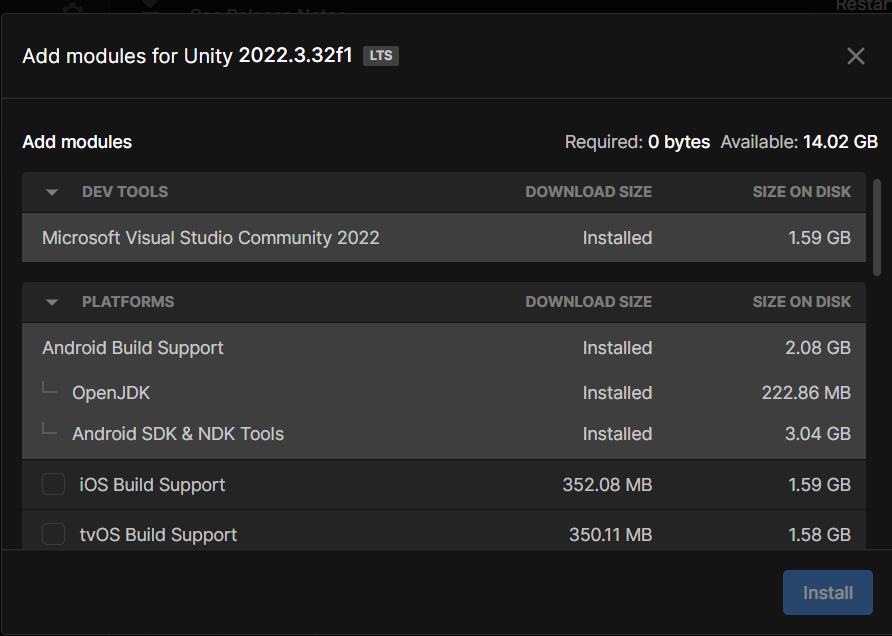
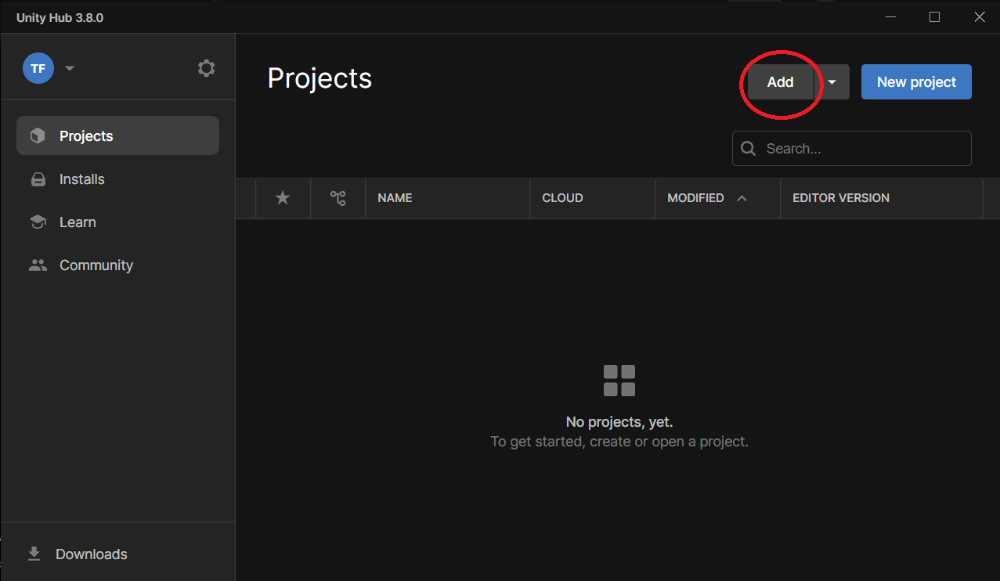
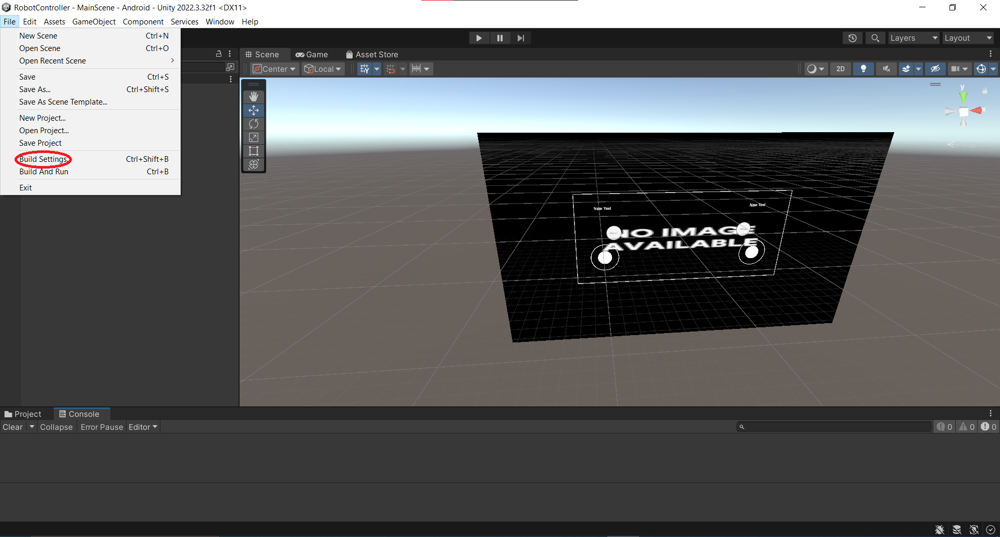
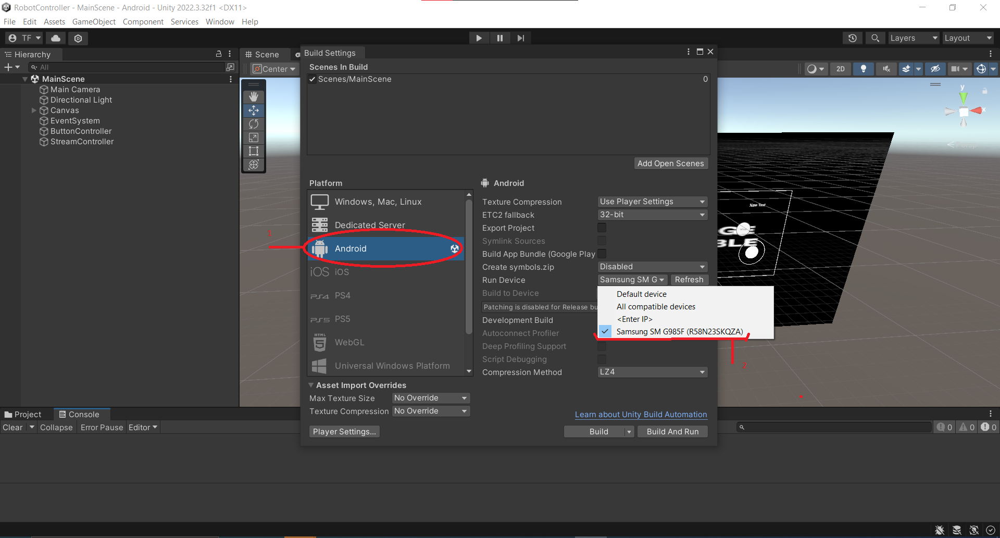
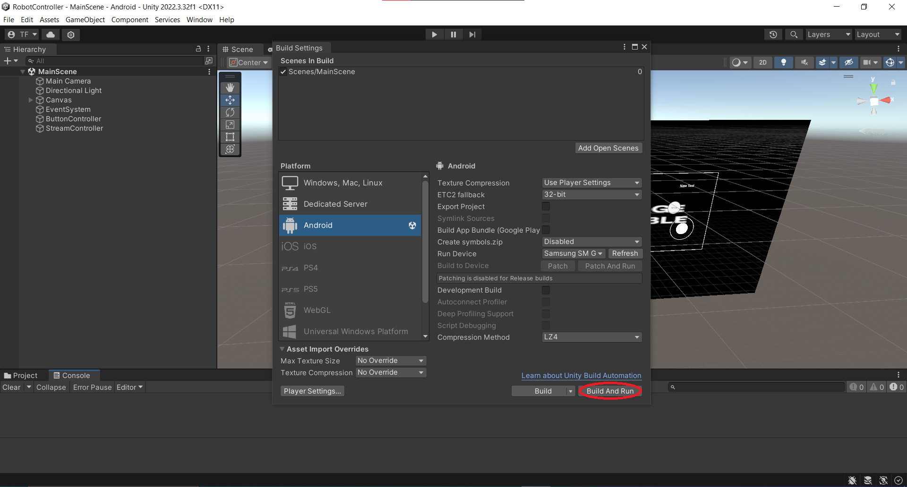

# Unity andoid application
#### ⚠️The application is mostly done but it need more tests⚠️
#### ⚠️Before following this README, please follow the instructions from the raspberry pi README⚠️
## Fast installation :
To install the application, follow these steps :
1. Download the RobotController.apk from Application_Unity/Builds.
2. Plug in your android phone and transfert the application into your storage.
3. Go to your android phone, find the apk and accept the installation.
4. Open the new application and your ready to go

## Opening the project and connecting your phone to Unity
### Installation of the necessary components.
Follow this easy guide to install Unity  
https://www.youtube.com/watch?v=DDPd2UKnoaU  
Install the 2022.3.32f1 version of Unity and be sure to have these modules :  

### Opening the project
In the project tab, click on Add.

Go and find the "RobotController" folder and select it. Click open. 
It will take some time.   
Meanwhile get your phone and activate the developper mode. Follow this tutorial: https://www.youtube.com/watch?v=gn4bRTFicZw  
When the developper mode is activated, turn on the option USB debug in the developper tab. Plug your phone to your PC.  
Follow these steps when the project is open

The build will take some time, especially on during the first time.
After that the app will run on your smartphone. You can modify anything you want in the project if you want to modify the project.
