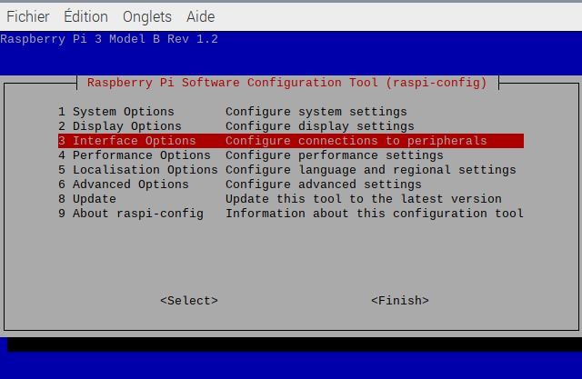
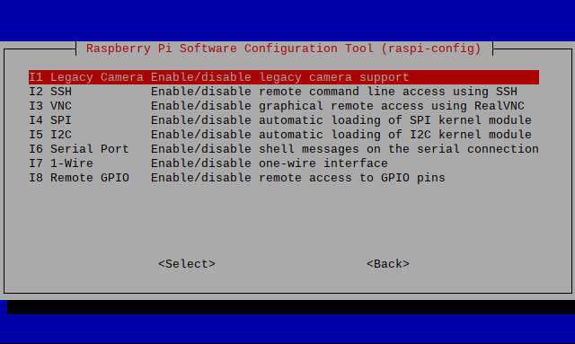

# Rapsberry-Pi configuration
#### ⚠️Before making any of the following instructions, be sure to setup all of the electronics. You also need a SD card that has at least 16GB of space⚠️

Welcome to the configuration of the raspberry pi. This file will be seperated between to 3 major parts : 
1. Raspberry Pi Setup
2. Camera, Network and video-streaming
3. Motors and canon configuration

Be sure to make to follow in order the steps.

## 1. Raspberry Pi setup 
For this step you will need : 
- A RaspberryPi 3b+ 
- A microSD card which has at least 16GB of storage 
- A SD card/micro SD card reader for you computer/laptop if they  do not have one
- A monitor to connect to the raspberry pi via its HDMI port
- A mouse and keyboard to connect to the USB ports of the raspberry pi

#### ⚠️You will flash a new OS on your MicroSD card. Everything will be erased on it. Be sure to backup everything before making any further step. ⚠️

You can follow this tutorial to setup your raspberry pi 
https://www.youtube.com/watch?v=g2e9RTcXKwg <br>
However you must be aware of the differences :
- The device must be a raspberry pi 3B+
- You need to get the lastest OS version
- You only need to setup the Wifi in "edit settings" you can adapt your country if you want too

After setting up the raspberry pi, open a terminal and install git if not already done (you have to be connected to you wifi) : 
``` bash 
sudo apt-get update
sudo apt-get install -y git
```
And clone in a chosen folder this repository. 
``` bash
git clone https://github.com/Shappow/Drone-R6.git
```
Switch to the Raspberry Pi Branch to save space on your SD card
``` bash
git checkout Raspberry-Pi
```
## 2. Setting up the Network, Camera and Start the video-streaming
### Setting up the camera
For this you will need the **Raspberry-Pi Camera V2**. You can buy it [here](https://www.amazon.fr/Raspberry-Pi-1080p-Module-Caméra/dp/B01ER2SKFS/ref=asc_df_B01ER2SKFS/?tag=googshopfr-21&linkCode=df0&hvadid=194988968614&hvpos=&hvnetw=g&hvrand=10344806919070677782&hvpone=&hvptwo=&hvqmt=&hvdev=c&hvdvcmdl=&hvlocint=&hvlocphy=9055302&hvtargid=pla-195348844379&psc=1&mcid=f413c81c64093678971ae84dd5345588) for example. <br>

Follow this tutorial to setup your camera. You also have a example code to you to check if the camera works.
https://www.youtube.com/watch?v=VzYGDq0D1mw

To be sure that the camera is correctly setup, we will need to be sure that legacy camera option is correctly enabled. <br>
Open a terminal and enter  : 
```bash
sudo raspi-config
```
You should have this interface that opens : <br> 

Go to Interface Options : <br>

Go to Legacy Camera : <br>

And select Yes. After that, use finish and reboot your rapsberry pi. You can do it with this command : 
``` bash
sudo reboot
```
### Importing all of the necessary librairies
Go to Raspberry Pi Code folder into your 

### Setting up the network


